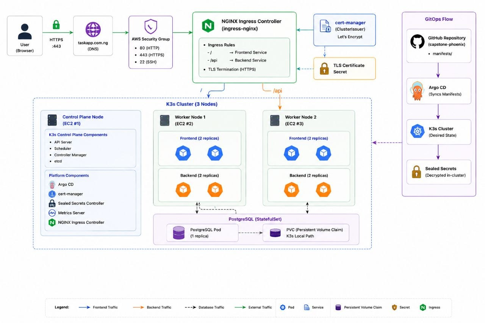
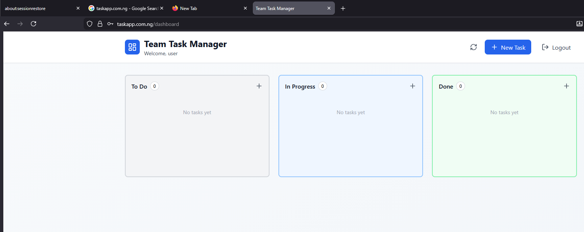

# 🚀 TaskApp — Cloud-Native DevOps Capstone

TaskApp is a containerized web application deployed on a multi-node Kubernetes (K3s) cluster running on AWS EC2.

The project demonstrates modern DevOps practices including:

* Infrastructure as Code
* Configuration Management
* Containerization
* Kubernetes orchestration
* CI/CD
* GitOps
* Automated TLS
* Secret management
* Network security
* Application scaling
* Persistent storage
* Self-healing deployments

---

# 🏗️ Architecture



# 🛠️ Technology Stack

**Cloud**

* AWS EC2
* AWS VPC
* AWS Security Groups
* AWS S3

**Infrastructure**

* Terraform
* Ansible

**Containerization**

* Docker
* GitHub Container Registry (GHCR)

**Kubernetes**

* K3s / Kubernetes
* Services & Deployments
* StatefulSets & PersistentVolumeClaims
* Horizontal Pod Autoscaler (HPA)
* Pod Disruption Budgets (PDB)


**Ingress & TLS**

* NGINX Ingress Controller
* cert-manager
* Let's Encrypt / HTTPS

**GitOps**

* Argo CD
* GitHub

**Security**

* Sealed Secrets & Kubernetes Secrets
*   AWS Security Groups
* SSH key authentication
* fail2ban
* ufw
* Non-root containers & Security contexts
* Resource limits

**Application**

* React Frontend / Nginx
* Flask Backend / Gunicorn
* PostgreSQL & Alembic

---

# ☁️ Infrastructure

The infrastructure is provisioned using Terraform.

The AWS environment contains:

* 1 K3s control-plane EC2 instance
* 2 K3s worker EC2 instances
* VPC networking, Subnets, and Security Groups
* SSH access
* S3 remote Terraform state

**Cluster Topology:**

```text
EC2 #1 (K3s Control Plane)
          │
      ┌───┴───┐
      ▼       ▼
   EC2 #2   EC2 #3
  Worker 1 Worker 2

```

Ansible is used to configure the EC2 instances and install K3s.

---

# 📦 Kubernetes Application

The application runs in the `phoenix` namespace.

**Repository Structure for Manifests:**

```text
manifests/
├── namespace.yaml
├── configmap.yaml
├── sealed-secret.yaml
├── backend/
│   ├── deployment.yaml
│   ├── service.yaml
│   ├── hpa.yaml
│   ├── pdb.yaml
│   ├── networkpolicy.yaml
│   └── serviceaccount.yaml
├── frontend/
│   ├── deployment.yaml
│   ├── service.yaml
│   ├── pdb.yaml
│   ├── networkpolicy.yaml
│   └── serviceaccount.yaml
├── postgres/
│   ├── statefulset.yaml
│   ├── pvc.yaml
│   ├── headless-service.yaml
│   └── networkpolicy.yaml
├── migration/
│   └── migration-job.yaml
└── ingress/
    ├── clusterissuer.yaml
    ├── certificate.yaml
    └── ingress.yaml

```

---

# 🗄️ PostgreSQL Storage

PostgreSQL runs as a Kubernetes StatefulSet:

```text
PostgreSQL ──► PersistentVolumeClaim ──► K3s local-path storage

```

The application uses a PVC rather than a Docker host volume. This allows Kubernetes to manage the storage resource independently from the PostgreSQL Pod.

> **Note:** The current PostgreSQL storage uses K3s local-path storage rather than AWS EBS. This provides persistence across Pod restarts but does not provide replicated database storage across worker nodes.

---

# 🔐 Secrets Management

Secrets are managed using Bitnami Sealed Secrets. Sensitive values (PostgreSQL password, Flask `SECRET_KEY`, JWT secret, database connection string) are not committed to GitHub as plaintext.

**Secret Workflow:**

```text
Plain Secret ──► kubeseal ──► SealedSecret ──► GitHub ──► Argo CD ──► K3s Cluster ──► Kubernetes Secret

```

---

# 🔒 TLS & Ingress

NGINX Ingress provides the public entry point to the application. Traffic is routed using the following rules:

* `[https://taskapp.com.ng/](https://taskapp.com.ng/)` ──► Frontend Service `:80`
* `[https://taskapp.com.ng/api](https://taskapp.com.ng/api)` ──► Backend Service `:5000`

TLS certificates are automatically managed using **cert-manager**, **Let's Encrypt**, ClusterIssuers, and Certificates.

---

# 🔄 GitOps

Argo CD continuously synchronizes the Kubernetes cluster with the GitHub repository (the single source of truth).

```text
Developer ──► GitHub ──► Argo CD ──► K3s Cluster ──► TaskApp

```

Argo CD configuration features:

* Automated synchronization
* Self-healing
* Automatic pruning

Application changes are deployed directly through Git pushes rather than manually running `kubectl apply`.

---

# 🔁 CI/CD Pipeline

Application images are built and published to GitHub Container Registry using GitHub Actions.

```text
Developer Push ──► GitHub Actions ──► Docker Build ──► GHCR ──► Image Tag Updated ──► Git Commit ──► Argo CD ──► K3s Rolling Update

```

**Image Naming Convention:**

* `ghcr.io/cyberboy001/taskapp-frontend:v1.0.2`
* `ghcr.io/cyberboy001/taskapp-backend:v1.0.2`

Immutable version tags are used instead of `latest`.

---

# 🛡️ Security Controls

* AWS Security Groups & restricted SSH access
* Kubernetes NetworkPolicies
* Sealed Secrets (no plaintext secrets in Git)
* HTTPS with Let's Encrypt certificates
* Non-root containers & security contexts
* Dropped Linux capabilities
* Resource requests and limits
* Startup, readiness, and liveness probes
* Kubernetes API port `6443` not exposed publicly

---

# 📚 Documentation

Additional project documentation is located in the `docs/` directory:

```text
docs/
├── ARCHITECTURE.md
├── RUNBOOK.md
├── COST.md
└── EVIDENCE/

```

* **`ARCHITECTURE.md`:** Details cluster topology, network architecture, request flow, and Kubernetes design decisions.
* **`RUNBOOK.md`:** Step-by-step procedures for infrastructure deployment, scaling, rollbacks, troubleshooting, and node/database recovery.
* **`COST.md`:** Breakdown of monthly AWS infrastructure costs, Free Tier assumptions, and cost-reduction strategies.
* **`EVIDENCE/`:** Visual proof and CLI outputs demonstrating multi-node cluster health, TLS status, HPA, Argo CD sync, and storage persistence.

---

# 🎯 Project Objectives

This project demonstrates the transition from a traditional single-server Docker deployment to a cloud-native Kubernetes platform:

* Infrastructure as Code with Terraform
* Automated server configuration with Ansible
* Multi-node K3s cluster deployment
* Kubernetes self-healing and autoscaling
* Persistent database storage
* Secure secret management
* Automated TLS & NGINX Ingress routing
* GitOps continuous delivery with Argo CD
* Zero-downtime rolling deployments

---

# 📌 Current Architecture Breakdown

```text
AWS Infrastructure
├── EC2 1 (K3s Control Plane)
├── EC2 2 (K3s Worker)
└── EC2 3 (K3s Worker)

K3s System Components
├── NGINX Ingress Controller
├── cert-manager
├── Sealed Secrets
├── Argo CD
└── Metrics Server

Phoenix Namespace
├── Frontend Replicas (x2)
├── Backend Replicas (x2)
├── PostgreSQL StatefulSet
├── Migration Job
├── Services, HPA, PDB
└── NetworkPolicies

```

---

# 🧠 Lessons Learned

This project highlighted key differences between single-host container runtime behavior and multi-node orchestration, providing hands-on experience with:

* Resolving cross-node networking and storage dependencies
* Configuring declarative reconciliation loops with GitOps
* Enforcing zero-trust network policies and non-root execution inside pods
* Troubleshooting rolling updates and secret management pipelines

---

# 🔮 Future Improvements

* Multi-control-plane high availability for K3s
* Highly available PostgreSQL cluster with automated backups
* Distributed persistent storage backed by AWS EBS
* Monitoring and logging stack using Prometheus, Grafana, and Loki
* External Secrets Operator integration

---

# 👨‍💻 Author

**Muhammad Alameen Suleiman**

*DevOps Engineer | Cybersecurity*

Nigeria

---

# 📄 License

This project is intended for educational and portfolio purposes.